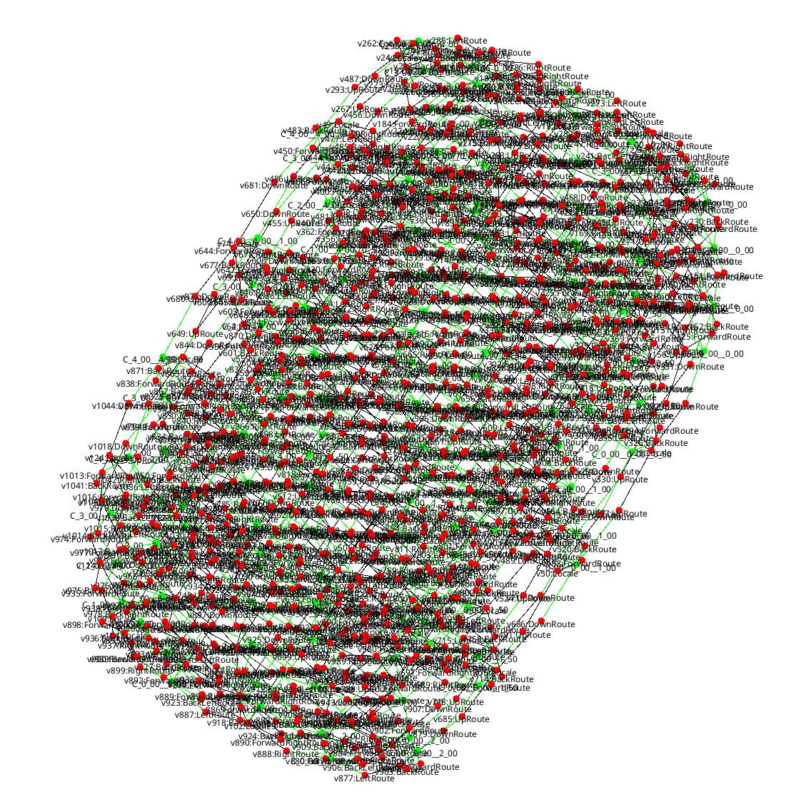

[](https://opensource.org/licenses/Apache-2.0)
[](https://central.sonatype.com/artifact/org.bigraphs.model.provider/model-provider-core)


# Bigraph Model Provider (Library)

The Bigraph Model Provider is a Java library designed for native bigraphical applications that are based on so-called _world models_. 

This library offers a set of standardized interfaces for querying, managing and integrating bigraphical models (e.g., spatial/location models), making it easy to connect with various data sources and sinks.

### Features
- Unified Interface for Bigraph Management: A simple interface for querying and managing bigraphical models.
- Custom Provider Support: Create custom providers by subclassing specific abstract classes or interfaces for specialized bigraph data handling needs.
- Data Source Integration: Attach providers to various data access technologies, including databases, web services, message queues, protocols, or other data storage and retrieval solutions.
- Composable Model Providers: Modular design is supported by combining smaller models into larger, complex structures. Finally, to create large _world models_.

## Overview

The Bigraph Model Provider library supports querying, and storing of bigraphical models.
Bigraphical models are expressive graph models, which can represent, for example, complex system designs or interactions of agent behavior. 
The generic, extensible class hierarchy of this library that allows users to integrate a wide range of data sources.

### Providers

Providers come in different flavors:
- Signatures (Syntax): They specify the types and constraints of a bigraphical model.
- Host Bigraphs (Data): Allow for the representation of individual bigraph instances.
- Rules (Behavior): Define constrained transformations applied to bigraphs.
- Composites: Some model providers can even be composed to construct larger models from smaller sub-models.

Technically,
all providers are signature providers since every bigraphical model
(e.g., a rule, or a host bigraph) is specified over a signature.

## Usage

**Maven Configuration**

```xml
<dependency>
    <groupId>org.bigraphs.model.provider</groupId>
    <artifactId>model-provider-core</artifactId>
    <version>1.2.2</version>
</dependency>
```

## Examples

| **4x4 Diagonal Bi-Grid**                                                             | **5x5 3-dimensional Bi-Grid**                                                       |
|--------------------------------------------------------------------------------------|-------------------------------------------------------------------------------------|
|  |  |


## Building from Source

Execute the following goals to run the build:
```shell
$ mvn clean install
```
The `*.jar` can be found inside the `./target/` folder of this project.
The dependency will be also installed in the local Maven repository and
can be used in other projects by following the instruction given [above](#Usage)

## License

This library is Open Source software released under the Apache 2.0 license.